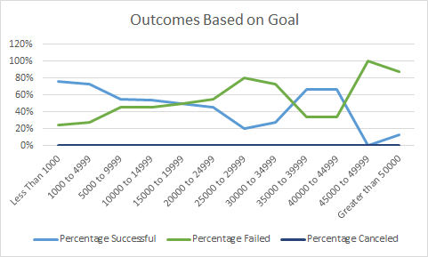

# To Be or Not to be...Data Analysis on Kickstarter Theater Campaigns 

## Project Overview

### Purpose and Background
* Reveal trends/strategies for starting a successful Kickstarter Theater campaign.
* Focus of the analysis will be on 1) Outcomes based on launch date of theater campaign and 2) Outcomes based on theater campaign funding goals
* Analysis conducted with use of Microsoft Excel.

## Analysis and Challenges

### 1) Analysis of Outcomes Based on Launch Date
In the first area of analysis, this project compared the number of successful, failed, and canceled theater campaigns to theater campaign launch dates (December-January). There was a total of 839 successful, 493 failed, and 37 canceled campaigns. The highest number of successful campaigns occurred in the month of May at a count of 111. The lowest number of successful campaigns occurred in the month of December, count of 37. The highest number of failed campaigns occurred in the month of July, count of 50. The lowest number of failed campaigns occurred in the month of November, count of 31.  The highest number of cancelled campaigns occurred in January, count of 7. The lowest number of canceled campaigns was in October, count of 0. Analysis displayed in below chart. 

### 2) Analysis of Outcomes Based on Funding Goals
In the second area of analysis, this project compared the funding goals and outcomes (successful, failed and canceled campaigns) for theater plays. Funding goals were grouped in 12 ranges (Less than $1000, $1000 to $4999, etc.). Percentages were calculated based on the outcome and total number of campaigns. Highest percentage of successful campaigns had funding goals less than $1000 at 76%. The lowest percentage of successful campaigns had funding goals at $45000 to $49999 at 0%. The highest percentage of failed campaigns had funding goals at $45000 to $49999 at 100%. The lowest percentage of failed campaigns had funding goals at $1000 to $4999 at 24%. There were no canceled theater play campaigns. Analysis displayed in below chart.

### Challenges and Difficulties Encountered
* Some difficulty in understanding and inputing COUNTIFS functions in Microsoft Excel in figuring out launch date outcomes
  * I was able to understand and input these formulas correctly after reaching out from support from office hours, and trial and error.
* Editing outcome charts on Excel so that they depict the data effectively.
  * I reviewed the challenge instructions, and through trial and error, I was able to work through this difficulty.
## Results

### Conclusions
* Outcomes based on launch date
  * The optimal time to launch a theater campaign is Early Summer (Between May and June).
  * The least optimal time to launch a theater campaign is in Wintertime (Between November and March). 
  * The holiday season may be a factor for less successful campaigns.
* Outcomes based on funding goals
  * The most successful campaigns had funding goals set at less than $10000. 
  * Funding goals that were set over $45000, were likely to be failed campaigns.
  * Starting up a theater campaign with funding goals at less than $10000 would be the more successful route to take based on this analysis. 

### Limitations
* One limitation in this analysis is that there is no specific data in the data set that reflects how successful a theater campaign would be in a particular state in United States. 
* Another limitation to this analysis is the data may not reflect current socioeconomic enviornment relating to COVID-19 and the Delta variant, which may hinder outcomes for projects goals and launch date.

### Further Analysis
* This project could include specific plays that had successful outcomes and highest number of backers, displayed with a bar chart. 
* Using the two areas of analysis in this project, particular countries could be looked at, and displayed with a line graph.
